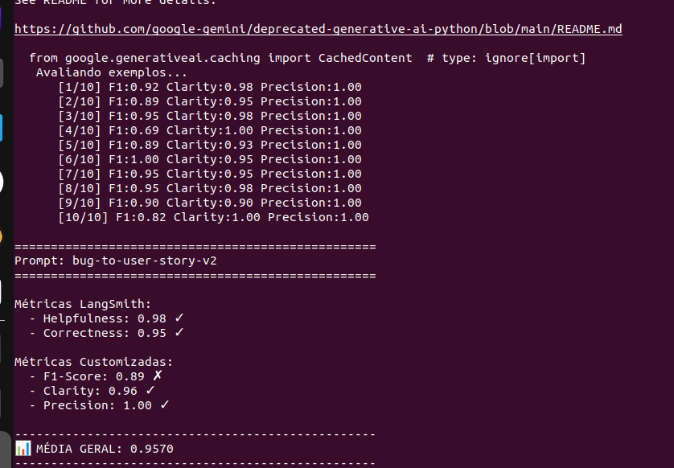

# Entregável

## Técnicas Aplicadas
- role_prompting
  
    Define explicitamente o papel, senioridade e modelo mental esperado
    Direciona o vocabulário, nível de detalhe, trade-offs e critérios de decisão

    Cria um cenário que ajude a definir um contexto da personalidade do experto.
    Defina os atores e conceitos para limitar o mundo onde será aplicado o prompt 

- few_shot_learning

    Definir exemplos realistas de entrada e saída

    Com isso o modelo entende:
    * Onde começa cada seção
    * Como os títulos são escritos
    * O nível de granularidade esperado em cada bloco

- rubric_based_prompting

    * Definir estrutura rígida em 13 seções

    * Criar Escalas definidas:

        Severidade (S0–S4)
        Prioridade (P0–P3)

    * Adicionar Regras claras de:

        Cobertura

        Limite de cenários
  
        Modo Simples / Moderado / Complexo

        Critérios objetivos de qualidade (DoD, Validação de Cobertura)

    * O mais importante, dada a severidade indicar quais regras usar. Problemas complexos explicações claras, problemas simples soluções simples e curtas

## Modelos usados
LLM_PROVIDER=google

LLM_MODEL=gemini-2.5-pro

EVAL_MODEL=gemini-2.5-pro

## Custo


## Resultados
### Tone Score, Aceceptance, User Story Format, Completeness
Última rodada


### F1-Score, Clarity, Precision
Achei que era com estas métricas que precisava serem entregues


## Feedbacks LangSmith

### Primeira Rodada
Fiz uma leitura dos feedbacks, e as User Stories não era efetivas e claras, eram verbosas e não comunicavam de forma eficiente o que se precisava resolver. As respostas não cobriam o que se esperava, eram explicações densas e incompletas

#### Avaliação Geral (Score)

<small>

**Score:** 0.75  

**Análise:**  
A resposta é extremamente bem organizada e tecnicamente precisa, sem ambiguidades.  
No entanto, a clareza é prejudicada pela falta de concisão. O modelo gerou um documento técnico excessivamente longo (11 seções), extrapolando o escopo da pergunta.  
Apesar da profundidade impressionante, a resposta se torna densa e menos eficiente para comunicação rápida e objetiva.

</small>

---

#### Precisão vs Recall — Caso 1

<small>

**Precision:** 1.0  
**Recall:** 0.5  

**Análise:**  
A precisão é máxima, pois a análise e a user story do problema de pagamento são corretas e altamente relevantes.  
Porém, o recall é limitado: dois dos quatro problemas críticos solicitados (XSS e race condition de cupom) foram completamente ignorados.  
A resposta é excelente no que cobre, mas incompleta em relação ao escopo total esperado.

</small>

---

#### Precisão vs Recall — Caso 2

<small>

**Precision:** 1.0  
**Recall:** 0.25  

**Análise:**  
A resposta apresenta alta qualidade técnica e profundidade, refletindo precisão elevada.  
Entretanto, aborda apenas um dos quatro problemas críticos (ordenação), omitindo conflitos de dados, uploads resilientes e crashes de memória por sincronização em lote.  
O foco restrito resulta em um recall extremamente baixo.

</small>

---

### Segunda Rodada

Depois da segunda rodada, adicionei seções obrigatorias, mas o que ajudou de fato nos relatos foi a llm struturar a seções. Nem todas as stories são complexas e não precisam de todas as seções.
A llm precisa indicar o necessario para criar a story, e não usar palavras que fujam do escopo.
Tentei olhar o feeedback e ir acertando o prompt

Depois apliquei a terceira rodada usando as métricas corretas

#### Avaliação Geral (Score)

<small>

**Score:** 0.7  

**Análise:**  
A resposta é extremamente bem organizada, precisa e livre de ambiguidades.  
Contudo, sofre severamente com falta de concisão, transformando um simples relato de bug em um documento técnico exaustivo.  
O uso excessivo de jargões técnicos e o volume de informação acabam ofuscando a mensagem principal.

</small>

---

#### Precisão vs Recall — Caso 1

<small>

**Precision:** 1.0  
**Recall:** 0.6  

**Análise:**  
A precisão é total, pois todo o conteúdo é correto, relevante e bem estruturado, adotando adequadamente a persona de PM.  
O recall é parcial devido à omissão de critérios importantes de aceitação e acessibilidade, como:
- Largura do modal (90%)
- Fechamento com tecla ESC
- Gestão de foco do teclado
- Fechamento ao clicar no backdrop

</small>

---

#### Avaliação de Foco e Escopo

<small>

**Score:** 0.75  

**Análise:**  
A resposta é factualmente correta e tecnicamente sólida, sem alucinações.  
No entanto, apresenta foco extremamente limitado ao abordar apenas um dos quatro problemas críticos, ignorando XSS, race condition e UX.  
A ground truth esperada adota uma abordagem holística, tornando a resposta apenas parcialmente alinhada ao escopo solicitado.

</small>

---

#### Precisão vs Recall — Caso Repetido

<small>

**Precision:** 1.0  
**Recall:** 0.6  

**Análise:**  
Reforça-se o padrão observado: alta precisão técnica e excelente estruturação, mas com lacunas relevantes nos critérios de aceitação e acessibilidade esperados.

</small>

## Prompt Final no Smith Langchain
https://smith.langchain.com/hub/herrera-fullcyle-desafio2/h3rr3ra

## Como Executar
```bash
1. Configurar ambiente
pyenv activate mba-desafio-2
pip install -r requirements.txt

3. Configurar credenciais
cp .env.example .env

Edite .env com suas API keys

3. Pull do prompt inicial
python src/pull_prompts.py

4. Validar estrutura do prompt otimizado
pytest tests/test_prompts.py

5. Push do prompt otimizado para LangSmith

python src/push_prompts.py

6. Avaliar qualidade do prompt

Mude o nome do prompt

    prompts_to_evaluate = [
        "bug-to-user-story-v2",
    ]
#execute
python src/evaluate.py

