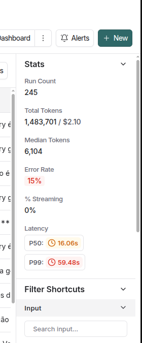
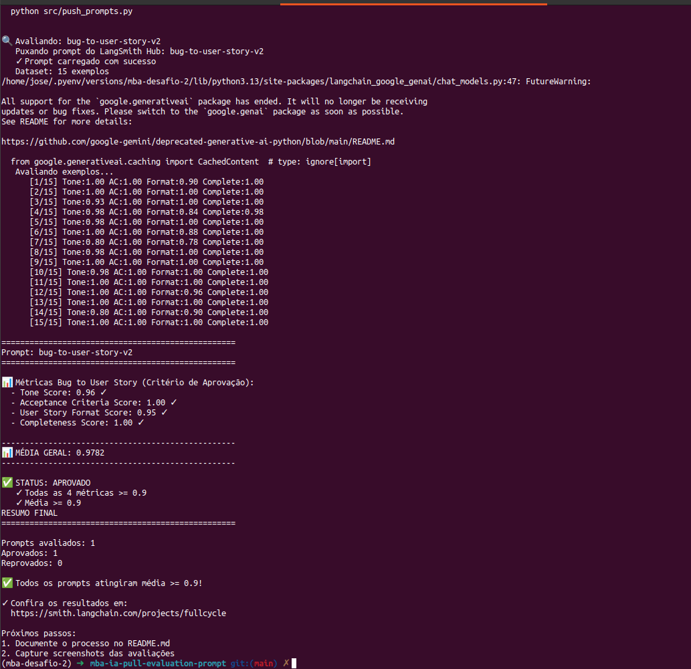

# Entregável

## Técnicas Aplicadas
- role_prompting
  
    Define explicitamente o papel, senioridade e modelo mental esperado
    Direciona o vocabulário, nível de detalhe, trade-offs e critérios de decisão

    Cria um cenário que ajude a definir um contexto da personalidade do experto.
    Defina os atores e conceitos para limitar o mundo onde será aplicado o prompt 

- few_shot_learning

    Definir exemplos realistas de entrada e saída

    Com isso o modelo entende:
    * Onde começa cada seção
    * Como os títulos são escritos
    * O nível de granularidade esperado em cada bloco

- rubric_based_prompting

    * Definir estrutura rígida em 13 seções

    * Criar Escalas definidas:

        Severidade (S0–S4)
        Prioridade (P0–P3)

    * Adicionar Regras claras de:

        Cobertura

        Limite de cenários
  
        Modo Simples / Moderado / Complexo

        Critérios objetivos de qualidade (DoD, Validação de Cobertura)

    * O mais importante, dada a severidade indicar quais regras usar. Problemas complexos explicações claras, problemas simples soluções simples e curtas

## Modelos usados
LLM_PROVIDER=google

LLM_MODEL=gemini-2.5-pro

EVAL_MODEL=gemini-2.5-pro

## Custo

## Resultados

## Prompt
https://smith.langchain.com/prompts/bug-to-user-story-v2?organizationId=4072ddb2-6f9b-4db7-840f-a1a5c0959040
